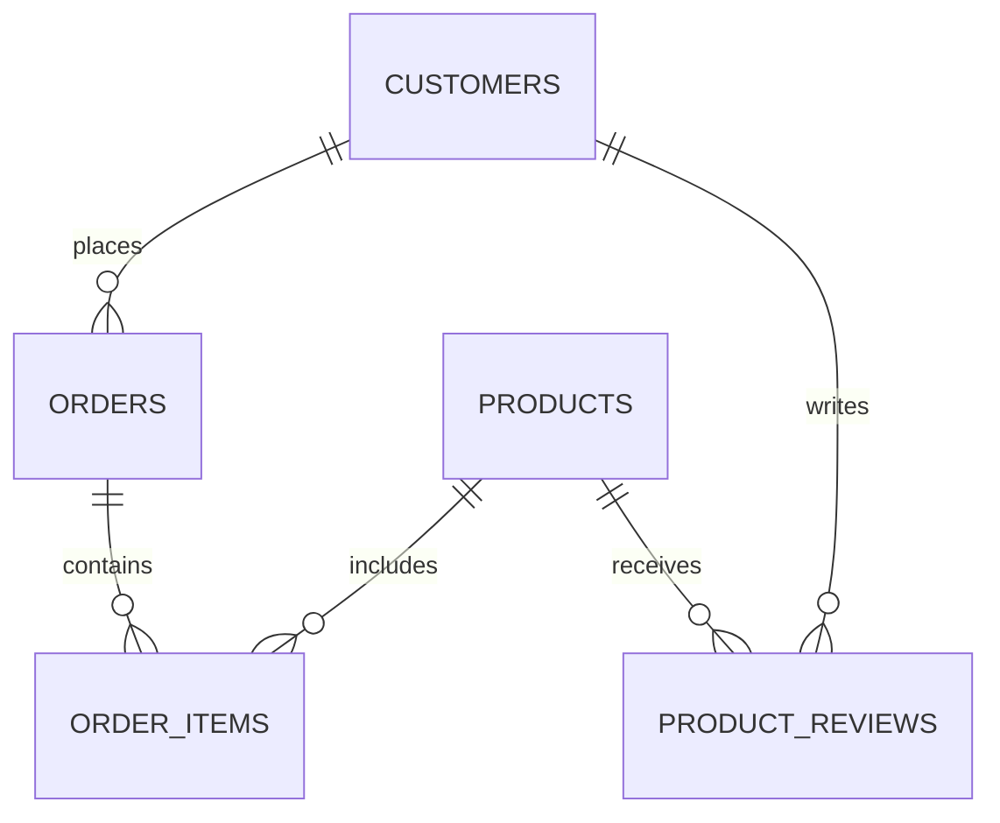

# 🛒 Synthetic E-Commerce Analysis with DuckDB

Questo progetto analizza un dataset e-commerce sintetico in formato Parquet utilizzando DuckDB. L'obiettivo è identificare, per ciascun paese, il prodotto con il valore totale di vendita più alto, includendo:

- 💰 Totale vendite (`total_sales`)
- 📦 Quantità vendute (`total_quantity`)
- ⭐ Media delle recensioni (`avg_rating`)
- 👥 Numero di clienti unici (`customer_count`)
- 👨 Percentuale di clienti maschi (`male_percent`)
- 👩 Percentuale di clienti femmine (`female_percent`)

I risultati sono limitati ai primi 10 paesi per volume di vendite.

---

## 📦 Dataset Overview

Il dataset è composto da 5 tabelle relazionali:

| Tabella           | Campi principali                                                                 | Righe stimate |
|-------------------|----------------------------------------------------------------------------------|---------------|
| `customers`        | `customer_id`, `name`, `email`, `gender`, `signup_date`, `country`              | ~2 mln  |
| `products`         | `product_id`, `product_name`, `category`, `price`, `stock_quantity`, `brand`    | ~20 k       |
| `orders`           | `order_id`, `customer_id`, `order_date`, `total_amount`, `payment_method`, `shipping_country` | ~8 mln    |
| `order_items`      | `order_item_id`, `order_id`, `product_id`, `quantity`, `unit_price`             | ~20 mln    |
| `product_reviews`  | `review_id`, `product_id`, `customer_id`, `rating`, `review_text`, `review_date`| ~4 mln      |

Fonte: [Synthetic E-Commerce Relational Dataset su Kaggle](https://www.kaggle.com/datasets/naelaqel/synthetic-e-commerce-relational-dataset?resource=download)

---

## 🧬 Entity Relationship Diagram (ERD)



---

## 🧠 Query DuckDB

La seguente query estrae, per ciascun paese, il prodotto con il valore totale di vendita più alto, includendo tutte le metriche richieste. I risultati sono limitati ai primi 10 paesi per volume di vendite:

```sql
WITH product_sales AS (
    SELECT
        o.shipping_country AS country,
        oi.product_id,
        p.product_name,
        SUM(o.total_amount) AS total_sales,
        SUM(oi.quantity) AS total_quantity
    FROM read_parquet('parquet/orders.parquet') o
    JOIN read_parquet('parquet/order_items.parquet') oi ON o.order_id = oi.order_id
    JOIN read_parquet('parquet/products.parquet') p ON oi.product_id = p.product_id
    GROUP BY country, oi.product_id, p.product_name
),
product_ratings AS (
    SELECT
        product_id,
        AVG(rating) AS avg_rating
    FROM read_parquet('parquet/product_reviews.parquet')
    GROUP BY product_id
),
product_customers AS (
    SELECT
        oi.product_id,
        COUNT(DISTINCT o.customer_id) AS customer_count,
        100.0 * SUM(CASE WHEN c.gender = 'Male' THEN 1 ELSE 0 END) / COUNT(DISTINCT o.customer_id) AS male_percent,
        100.0 * SUM(CASE WHEN c.gender = 'Female' THEN 1 ELSE 0 END) / COUNT(DISTINCT o.customer_id) AS female_percent
    FROM read_parquet('parquet/orders.parquet') o
    JOIN read_parquet('parquet/order_items.parquet') oi ON o.order_id = oi.order_id
    JOIN read_parquet('parquet/customers.parquet') c ON o.customer_id = c.customer_id
    GROUP BY oi.product_id
),
ranked_sales AS (
    SELECT ps.*, pr.avg_rating, pc.customer_count, pc.male_percent, pc.female_percent,
           RANK() OVER (PARTITION BY ps.country ORDER BY ps.total_sales DESC) AS rank
    FROM product_sales ps
    LEFT JOIN product_ratings pr ON ps.product_id = pr.product_id
    LEFT JOIN product_customers pc ON ps.product_id = pc.product_id
),
top_countries AS (
    SELECT country, MAX(total_sales) AS max_sales
    FROM product_sales
    GROUP BY country
    ORDER BY max_sales DESC
    LIMIT 10
)
SELECT rs.country, rs.product_name, rs.total_sales, rs.total_quantity, rs.avg_rating,
       rs.customer_count, rs.male_percent, rs.female_percent
FROM ranked_sales rs
JOIN top_countries tc ON rs.country = tc.country
WHERE rs.rank = 1
ORDER BY rs.total_sales DESC;
```

---

## 📁 Formato dei dati

I file sono disponibili in formato:
- `CSV` → per esplorazione manuale
- `Parquet` → per analisi ad alte prestazioni con DuckDB

---

## 📜 Licenza

MIT License — dataset generato sinteticamente con [Faker](https://faker.readthedocs.io/) e disponibile su [Kaggle](https://www.kaggle.com/code/naelaqel/synthetic-e-commerce-relational-dataset-generator)